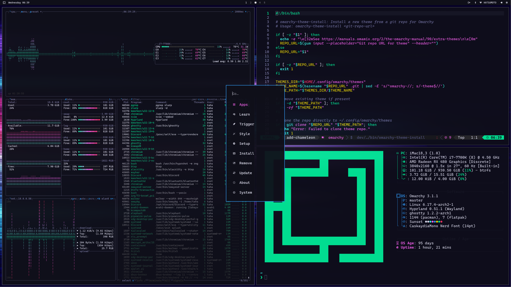

# Sunset Drive

Theme for [Omarchy Linux](https://omarchy.org) based on a synthwave aesthetic.

Made with [Omarchist](https://github.com/tahayvr/omarchist).

## Installation

```bash
omarchy-theme-install https://github.com/tahayvr/omarchy-sunset-drive-theme
```



## Neovim Colorscheme

[sunset-drive.nvim](https://github.com/tahayvr/sunset-drive.nvim) Made with [themery.nvim](https://github.com/tahayvr/themery.nvim)

## VSCode Theme

[Sunset Drive VSCode Theme](https://marketplace.visualstudio.com/items?itemName=TahaYVR.sunset-drive)

## License

MIT
